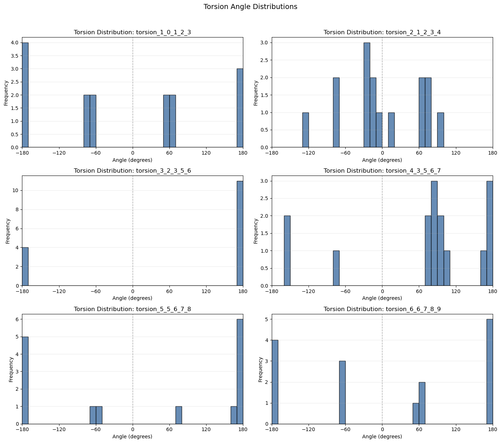

# Research Log

# Entry 1

## Goal: Initialize file structure and clarify project pipeline + start basin analysis

## What I tried:
- Shannon entropy derived from Boltzmann population
## Problems:
- Issues with keeping track of conformer list from initial state to filtered, unique, etc.
- Must be streamlined 
## Decisions:
- Opted to use functional methods to separate all pipeline steps
- Pipeline found in testing.ipynb developed in notebook was adapted for this study
- Used Shannon entropy as the next obvious step from conformer Boltzmann population calculations
## Observations:

## Questions:
- Boltzmann distribution → how should it properly be visualized and used in flexibility metrics?

## Next Steps:
- Implement basin clustering analysis
- Population analysis
- Torsional analysis

# Entry 2

## Goal: Add basin clustering analysis

## What I tried:
- Replacing unique_conformers initialization with basin compilation logic (based on RMSD)
- Takes ‘template’ molecules and groups based on other conformers’ similarities to them, then evaluates total populations of each basin group
## Problems:
None
## Decisions:
- Decided to keep unique conformer list to maintain functionality of entropy calculations and following implementations
## Observations:
- Flexible molecules have more basins with relatively lower populations (not a new observation, but proven by testing current iteration of implementation) 
- RMSD Threshold affects basin sizes, lower threshold leads to more narrow basins, and larger one leads to less, broader ones
## Questions:

## Next Steps:
- Torsion analysis
- Migrate to separate file function framework
- Solvent interaction additions

# Entry 3
## Goal(s): create basin heatmap visualization

## What I tried:

## Problems:
Initial project focus was overly broad, must move to a slightly more specific one that addresses computational chemistry’s capabilities in this analysis rather than direct insights on conformational dynamics themselves
## Decisions:
Narrowed scope of analysis
From “how do solvent environments affect conformational landscapes” to “Can ensemble level conformational metrics quantify solvent induced conformational collapse in flexible organic molecules?”
Addresses that we know that solvent polarity leads to different conformer dynamics, however, can we build a metric that can effectively quantify this change with computational methods?
## Observations:

## Questions:

## Next Steps:
Torsional analysis

# Entry 4
## Goal(s): Implement torsional analysis

## What I tried:
Torsion assignment algorithm, identifying ‘important’ torsions (via find_heavy_atom_torsions()) for molecule and evaluating torsion angles at those bonds for each basin representative conformer

Visualization: plotted angle distributions for each important torsion
## Problems:

## Decisions:
Left torsion naming as a coded system, but looking to implement classification later (backbone, functional group, etc.)
## Observations:
Testing with butyl butyrate (CCCC(=O)OCCCC) in vacuum (no solvents implemented yet), torsion angle distribution across each important torsion remains varied in spread
- Ex. torsion_3_2_3_5_6 demonstrates low/no flexibility in vacuum, with all angles across basins being equivalent (180°=-180°); meanwhile, torsion_4_3_5_6_7 demonstrates higher variability, indicating a more flexible bond

## Questions:

## Next Steps:
Solvent environment addition
Outsource notebook to structured system with API implementation; analysis begins
